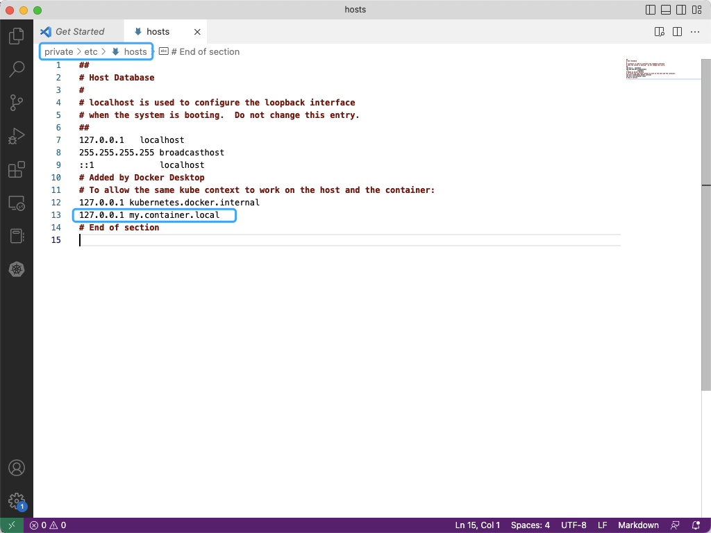
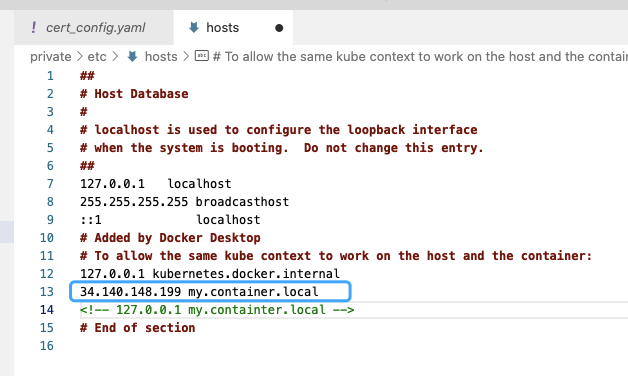

# README

Add `127.0.0.1 my.container.local` into host (/etc/hosts on macOS)



---

`brew install minikube` to install minikube. 

---

Install cert-manager, enable minikube addons storage-provisioner, default-storageclass

```python
minikube start

minikube addons enable storage-provisioner
minikube addons enable default-storageclass

kubectl apply -f https://github.com/cert-manager/cert-manager/releases/download/v1.11.0/cert-manager.yaml
kubectl get pods --namespace cert-manager # verify the installation by checking the cert-manager pods
```
---

Make your computer trust certificate authority in `/certificate/ca.crt`
```python
sudo security add-trusted-cert -d -r trustRoot -k /Library/Keychains/System.keychain ./certificate/ca.crt

```


# Installation
There are two ways to deploy locally.
## Using Helm

```python
brew install helm

helm install chart containerization -f helm_deployment/containerization/values.yaml
```

## Using kubectl
```python
minikube start --nodes 4

kubectl apply -f certificate/cert_config.yaml

kubectl apply -f database_config/postgres-config.yaml

kubectl apply -f database_config/postgres-secret.yaml

# kubectl apply all the .yaml file in services/*
kubectl apply -f ./services/auth/auth.yaml
kubectl apply -f ./services/database/postgres-deployment.yaml
kubectl apply -f ./services/database/postgres-service.yaml
kubectl apply -f ./services/main/main.yaml
kubectl apply -f ./services/nginx/nginx.yaml
kubectl apply -f ./services/nginx/service_nginx.yaml

# to check if 4 pods startup correctly
kubectl get pods 

```

### start portwarding

```python
sudo kubectl port-forward svc/nginx-service 443:5000 --address 127.0.0.1

https://my.container.local/
```

---

# Deploy it in the cloud

changing the ip address in the host file.



trying to ping this ip address ( 34.140.148.199 ) or open https://my.container.local/ in the browser.
# RBAC
Below is for how to create user1, in cert filefolder, there are three roles (admin, read-only and editor) which binding to three users ( user1, user2, user3 )

Below is how to create a client certificate for each user.
```
cd cert

#  Generate a key using OpenSSL
openssl genrsa -out user1.key 2048

# Generate a Client Sign Request (CSR), using key to pretect CSR
openssl req -new -key user1.key -out user1.csr -subj "/CN=user1/O=group1"

ls ~/.minikube/ # check that the files ca.crt and ca.key exists in this location.

# Generate the certificate (CRT)
openssl x509 -req -in user1.csr -CA ~/.minikube/ca.crt -CAkey ~/.minikube/ca.key -CAcreateserial -out user1.crt -days 500
```

Below is how to create the user in kubeconfig using certificate.
```

# Set a user entry in kubeconfig
kubectl config set-credentials user1 --client-certificate=user1.crt --client-key=user1.key

# Set a context entry in kubeconfig
kubectl config set-context user1-context --cluster=minikube --user=user1

# check that it is successfully added to kubeconfig:
kubectl config view

# Switching to the created user
# instead of using the minikube context, we want to use user1-context
kubectl config use-context user1-context
kubectl config current-context # check the current context: user1-context
```

Below is how to deploy different roles:
```
kubectl config use-context minikube
kubectl apply -f role-<*>.yaml
kubectl apply -f role-binding-<*>.yaml
```

For testing: 
how to go to different user context for test:
```
kubectl config use-context user<*>-context
```